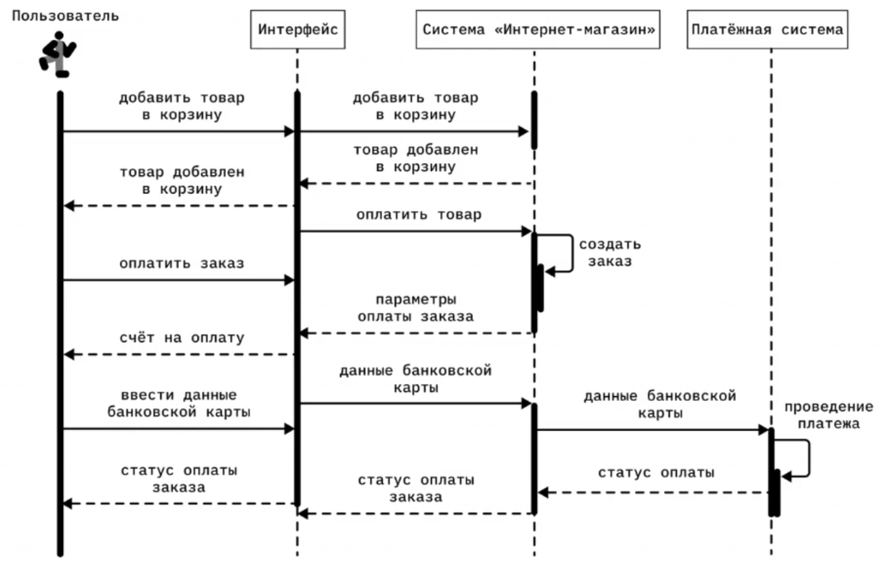
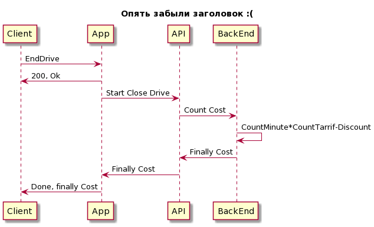

# Что вы видите на картинке? 

Системный аналитик Паша только недавно начал свою карьеру. Первым его заданием стало восстановить документацию к системе, от описания которой осталась одна диаграмма. Помоги Паше разобраться как устроена эта система, основываясь на UML-диаграмме последовательности.

